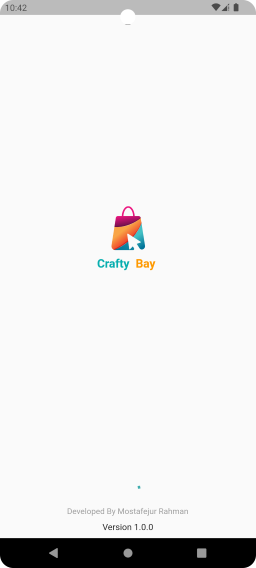
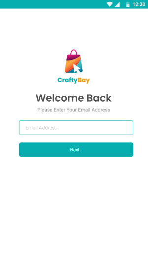
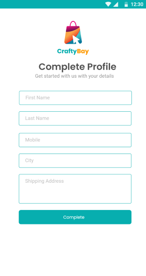
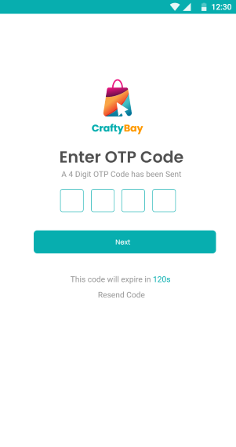
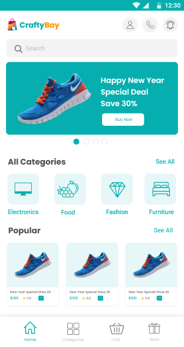
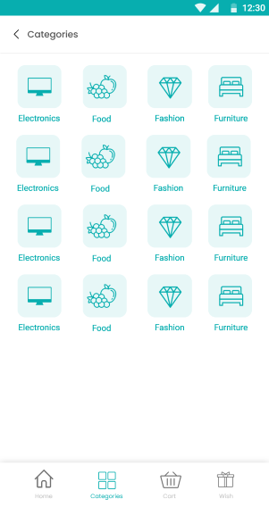
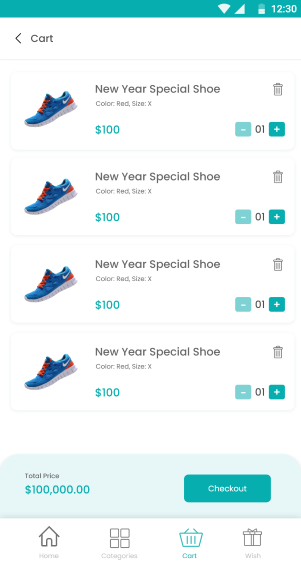
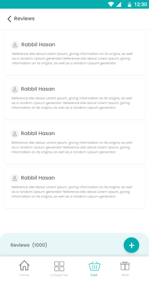
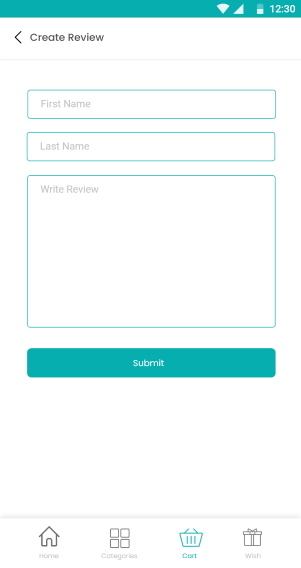

# Crafty-Bay

## Description

Welcome to Crafty-Bay. A full e-commerce application build using flutter, getx . This app is a complete ecommerce app with all the features like add to cart, wishlist, review, checkout etc. This app is built with flutter and dart.

## Responsibilities

As the creator of CraftyBay, my responsibilities included:

* Designing the app's user interface (UI).
* Developing the complete ecommerce app.
* Adding user profiles for a personalized shopping experience.
* Allowing product addition to wishlists for user convenience.
* Implementing color and size filters for product selection.
* Categorizing products into four distinct categories.
* Showcasing special, new, and popular products.
* Creating an attractive product carousel slider.
* Enabling users to write and share product reviews.

## Features of the app With Screenshots

| Task                | Screenshot                                  | Task                | Screenshot                                  |
|---------------------|--------------------------------------------|---------------------|--------------------------------------------|
| Splash Screen   |  | Login Screen    |     |
| Complete Profile Screen |  | OTP Verification Screen |  |
| Home Screen     |  | Categories Screen |    |
| Products Details Screen |  | Cart Screen |  |
| Wish List Screen |  | Review Showing Screen |  |
| Create Review Screen |  |

## Used Packages

CraftyBay integrates the following packages to enhance functionality:

* `flutter_svg: ^2.0.7:` A Flutter package for rendering SVG (Scalable Vector Graphics) images. It allows you to easily display and manipulate SVG files in your Flutter application.

* `get: ^4.6.5:` Get is a state management library for Flutter that simplifies the process of managing application state. It provides a clean and efficient way to handle state and dependencies in your app.

* `font_awesome_flutter: ^10.5.0:` This package allows you to easily integrate Font Awesome icons into your Flutter application. Font Awesome is a popular library of vector icons.
* `pin_code_fields: ^8.0.1:` Pin Code Fields is a Flutter package that helps you implement PIN or OTP input fields in your app. It's highly customizable and easy to use for user authentication and verification.
* `carousel_slider: ^4.2.1:` Carousel Slider is a package for creating image carousels and sliders in your Flutter app. It's useful for creating interactive and dynamic image galleries.
* `http: ^1.1.0:` The HTTP package provides a straightforward way to make HTTP requests in your Flutter app. It's essential for fetching data from APIs and working with web services.
* `flutter_launcher_icons: ^0.13.1:` This package simplifies the process of generating and setting app icons for your Flutter application. It allows you to customize app icons with ease.
* `shared_preferences: ^2.2.1:` Shared Preferences is a Flutter package for persisting simple key-value data in a platform-agnostic manner. It's commonly used for storing app settings and small amounts of data.
* `shimmer: ^3.0.0:` Shimmer is a package for adding a shimmering effect to your Flutter widgets. It's often used to create loading or placeholder animations to improve user experience.
* `connectivity_plus: ^5.0.1:` Connectivity Plus is a Flutter package for monitoring network connectivity. It helps you check the status of the device's network connection and react to changes in connectivity.
  
## folder structure

```root
craftyBay/
    ├── assets/
    │   └── images/
    └── lib/
        ├── application/
        │   ├── apps.dart
        │   └── state_holder_binding.dart
        ├── data/
        │   ├── models/
        │   │   ├── brands.dart
        │   │   ├── cart_list_data.dart
        │   │   ├── cart_list_model.dart
        │   │   ├── category_data.dart
        │   │   ├── category_model.dart
        │   │   ├── home_screen_slider_data.dart
        │   │   ├── home_screen_slider_model.dart
        │   │   ├── network_response.dart
        │   │   ├── products.dart
        │   │   ├── products_details.dart
        │   │   ├── products_details_model.dart
        │   │   ├── products_model.dart
        │   │   ├── review_list_model.dart
        │   │   └── user_read_profile_model.dart
        │   ├── services/
        │   │   └── network_caller.dart
        │   └── utils/
        │       └── url_links.dart
        ├── presentation/
        │   ├── state_holder/
        │   │   ├── add_to_cart_controller.dart
        │   │   ├── auth_controller.dart
        │   │   ├── cart_list_controller.dart
        │   │   ├── categories_controller.dart
        │   │   ├── complete_profile_controller.dart
        │   │   ├── create_review_controller.dart
        │   │   ├── create_wish_list.dart
        │   │   ├── delete_cart_list.dart
        │   │   ├── email_verification_controller.dart
        │   │   ├── home_screen_slider_controller.dart
        │   │   ├── main_bottom_nav_controller.dart
        │   │   ├── new_products_controller.dart
        │   │   ├── popular_products_controller.dart
        │   │   ├── products_details_controller.dart
        │   │   ├── products_wish_list_controller.dart
        │   │   ├── read_profile_controller.dart
        │   │   ├── review_list_controller.dart
        │   │   ├── spacial_products_controller.dart
        │   │   └── verify_login_controller.dart
        │   └── ui/
        │       ├── screen/
        │       │   ├── auth/
        │       │   │   ├── complete_profile_screen.dart
        │       │   │   ├── email_verification_screen.dart
        │       │   │   └── otp_screen.dart
        │       │   ├── cart_screen.dart
        │       │   ├── categories_screen.dart
        │       │   ├── create_review_screen.dart
        │       │   ├── home_screen.dart
        │       │   ├── item_screen.dart
        │       │   ├── main_bottom_nav_screen.dart
        │       │   ├── products_details_screen.dart
        │       │   ├── review_showing_screen.dart
        │       │   ├── splash_screen.dart
        │       │   └── wish_list_screen.dart
        │       ├── utils/
        │       │   ├── app_color.dart
        │       │   ├── color_extension.dart
        │       │   └── images_utils.dart
        │       └── widgets/
        │           ├── home_screen_widgets/
        │           │   ├── home_carousel_slider.dart
        │           │   ├── home_screen_search_bar.dart
        │           │   └── home_slider.dart
        │           ├── products_details_screen_widgets/
        │           │   ├── home_carousel_slider.dart
        │           │   └── home_screen_search_bar.dart
        │           ├── app_bar_icons.dart
        │           ├── bottom_price_details_and_button.dart
        │           ├── cart_screen_list_tile_card.dart
        │           ├── categories_card.dart
        │           ├── custom_app_bar.dart
        │           ├── custom_otp_field.dart
        │           ├── custom_stepper.dart
        │           ├── love_icon_button.dart
        │           ├── products_card.dart
        │           ├── products_carousel_slider.dart
        │           └── title_header_and_see_all_button.dart
        └── main.dart
```

## License

This project is licensed under the MIT License - see the [LICENSE.md](LICENSE.md) file for details.
